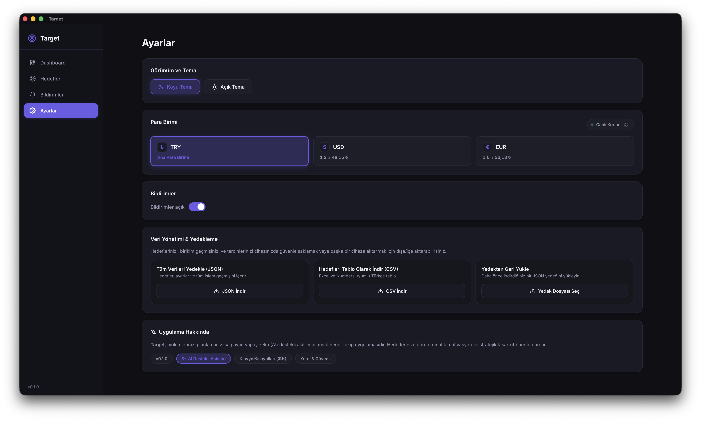

<div align="center">


# Target

**[🇬🇧 English Documentation](#-english-documentation) &nbsp;•&nbsp; [🇹🇷 Türkçe Dokümantasyon](#-türkçe-dokümantasyon)**

</div>

---

<a id="-english-documentation"></a>

<div align="center">

# 🇬🇧 Target • Smart Finance & Goal Tracking Assistant


**Target** is a modern desktop application that plans your savings, tracks your progress, and empowers you to reach your financial milestones faster with AI-powered strategies.

<br />

**[Features](#key-features) • [Screenshots](#application-screens) • [How to Use](#how-to-use) • [Tech Stack](#tech-stack) • [Getting Started](#getting-started)**

</div>

---

## What is Target?

Target allows you to manage all your financial goals—such as buying a home, purchasing a car, funding a vacation, investing in technology, or building an emergency fund—from a single dashboard.

By analyzing your current savings and target deadlines, it generates personalized savings roadmaps, calculates your remaining time, and shows exactly how much you need to save each month to stay on track.

---

## Key Features

- **AI-Powered Financial Strategist (Target AI)**
  - Mathematically analyzes the timeline, capital gap, and required velocity for your goals.
  - Computes the exact **daily and monthly net savings** required to reach deadlines.
  - Delivers actionable execution steps including the 50/30/20 budget framework, expense optimization, and micro-savings strategies.

- **Interactive What-If Savings Calculator & Simulation**
  - Experiment with various monthly savings amounts using an intuitive live slider.
  - Instantly calculate projected completion dates and required daily pace for any financial goal.
  - Get instant Target AI feedback and feasibility evaluation on simulated scenarios.

- **Multi-Currency Support & Live Exchange Rates**
  - Create goals in any currency (**Turkish Lira ₺**, **US Dollar $**, **Euro €**).
  - Seamlessly convert and view your entire portfolio in your preferred dashboard currency with real-time exchange rates.

- **Comprehensive Portfolio & Progress Analytics**
  - Track overall completion rates across all goals with interactive donut progress rings and monthly savings trend charts.
  - Instantly see remaining balances, days left, required monthly velocity, and individual goal breakdown at a glance.
  - Pin your highest-priority goals directly to the overview dashboard.

- **Transaction History & Ledger**
  - Record and review deposit and withdrawal transactions per goal with customizable notes.
  - Keep a clean, transparent financial audit trail for all your savings milestones.

- **Data Management & Backup**
  - Full JSON backup and restore to easily migrate your portfolio across devices.
  - Export your goals into clean, spreadsheet-ready CSV tables.

- **Cyclic Wheel Time Picker & Smart Reminders**
  - Set custom notification alarms using an intuitive cyclic drum-wheel time picker.
  - Choose from quick presets (Morning, Noon, Evening, Night) and schedule recurrences (Every Day, Weekdays, Weekends).
  - Stay accountable with regular progress summaries and financial discipline tips.

- **Global Command Palette (⌘K) & Keyboard Shortcuts**
  - Instant spotlight navigation, quick goal creation (⌘N), and search across all goals and actions.

- **Sleek & Distraction-Free Modern Design**
  - Elegant dark mode, smooth micro-animations, and clean typography tailored for focus.

---

## Application Screens

### 1. Overview & Portfolio Progress (Dashboard)
Clean dashboard displaying total portfolio balance, target metrics, quick simulation trigger, currency switcher, interactive donut progress ring, and priority goals:
<div align="center">
  
</div>

---

### 2. Monthly Savings Velocity (Trend Analytics)
Bar chart tracking your net monthly deposit volume across the last 6 months to visualize your savings momentum:
<div align="center">
  
</div>

---

### 3. Interactive What-If Simulation Calculator
Simulate how adjusting your monthly contribution changes your completion timeline, daily load, and get instant Target AI scenario analysis:
<div align="center">
  
</div>

---

### 4. Goal Management & Progress Tracking
Active goals view with progress bars, remaining amounts, countdowns, monthly required pace, and quick action buttons:
<div align="center">
  
</div>

---

### 5. New Goal Creation
Create financial targets with custom currency selections, target deadlines, initial savings, and dashboard pinning preferences:
<div align="center">
  
</div>

---

### 6. Smart Reminders & Drum Wheel Time Picker
Cyclic drum wheel time picker for scheduling reminder alarms, preset time slots, and granular per-goal notification settings:
<div align="center">
  
</div>

---

### 7. Settings, Live Exchange Rates & Data Backup
Theme customization, live exchange rate monitoring, JSON backup/restore, spreadsheet CSV export, and keyboard shortcut info:
<div align="center">
  
</div>

---

## How to Use?

1. **Set a Goal**: Enter what you want to achieve, your target amount, currency, and deadline.
2. **Add Savings**: Update your saved funds over time and watch your progress update live across interactive charts.
3. **Consult Target AI**: Receive personalized financial strategies and actionable budget guidance tailored to your goal timeline.
4. **Set Up Reminders**: Schedule daily or weekly reminders to maintain a consistent saving habit.

---

## Tech Stack

Target is built with a high-performance desktop architecture leveraging Rust for native system integration and React 19 for a fluid, responsive UI.

| Layer | Technology | Details |
| :--- | :--- | :--- |
| **Desktop Core** | [Tauri v2](https://v2.tauri.app/) + [Rust](https://www.rust-lang.org/) | Native desktop runtime, background notifications, and secure file I/O |
| **Frontend UI** | [React 19](https://react.dev/) + [TypeScript](https://www.typescriptlang.org/) | Type-safe declarative components and reactive state |
| **Build Tool** | [Vite 7](https://vite.dev/) | Lightning-fast HMR and optimized production bundling |
| **AI Strategist** | [Google Gemini API](https://ai.google.dev/) (`gemini-2.5-flash-lite`) | Automated financial timeline calculation and strategic advice |
| **Styling** | Custom Vanilla CSS / Design System | Curated dark mode, glassmorphism, responsive typography & micro-interactions |
| **Native Plugins** | `@tauri-apps/plugin-notification`, `@tauri-apps/plugin-opener` | Native system notifications and browser URL dispatching |

---

## Getting Started

### Prerequisites

Ensure you have **Node.js (v18+)** and **Rust** installed on your system:

#### 1. Install Rust & Cargo
```bash
# macOS & Linux:
curl --proto '=https' --tlsv1.2 -sSf https://sh.rustup.rs | sh

# Windows (PowerShell):
winget install --id Rustlang.Rustup
```

#### 2. Install Node.js (LTS)
```bash
# macOS (Homebrew):
brew install node

# Linux (Ubuntu/Debian):
curl -fsSL https://deb.nodesource.com/setup_20.x | sudo -E bash - && sudo apt install -y nodejs

# Windows (PowerShell):
winget install OpenJS.NodeJS.LTS
```

#### 3. Tauri System Dependencies
- **macOS**:
  ```bash
  xcode-select --install
  ```
- **Linux (Ubuntu/Debian)**:
  ```bash
  sudo apt update && sudo apt install -y libwebkit2gtk-4.1-dev build-essential curl wget file libxdo-dev libssl-dev libayatana-appindicator3-dev librsvg2-dev
  ```
- **Windows**: Microsoft C++ Build Tools & WebView2 (pre-installed on Windows 10/11)

---

### Installation & Execution

#### 1. Clone the Repository
```bash
git clone https://github.com/orkunerylmz/Target.git
cd Target
```

#### 2. Install Frontend Dependencies
```bash
npm install
```

#### 3. Configure Environment Variables
Create a `.env` file in the root directory by copying `.env.example`:
```bash
cp .env.example .env
```
Open `.env` and configure your **Gemini API Key**:
```env
GEMINI_API_KEY=your_gemini_api_key_here
GEMINI_MODEL=gemini-2.5-flash-lite
```
> [!NOTE]
> You can obtain a free Google Gemini API key from [Google AI Studio](https://aistudio.google.com/).

#### 4. Run in Development Mode
Launch both the Vite dev server and the Tauri native desktop window with live Hot Module Replacement (HMR):
```bash
npm run tauri dev
```

#### 5. Build for Production
Create an optimized, standalone desktop installer/executable (`.dmg` on macOS, `.msi` / `.exe` on Windows, `.deb` / `.AppImage` on Linux):
```bash
npm run tauri build
```
Built binaries will be located under `src-tauri/target/release/bundle/`.

---

### Available Scripts

| Command | Description |
| :--- | :--- |
| `npm run tauri dev` | Starts the desktop application in development mode with HMR |
| `npm run tauri build` | Bundles and builds the native production desktop application |
| `npm run dev` | Starts only the Vite frontend dev server (browser preview on `http://localhost:1420`) |
| `npm run build` | Compiles TypeScript and builds the frontend production bundle (`dist/`) |
| `npm run preview` | Locally previews the compiled frontend build |

---

## License

This project is licensed under the MIT License - see the [LICENSE](LICENSE) file for details.

<br />

---
---

<br />

<a id="-türkçe-dokümantasyon"></a>

<div align="center">

# 🇹🇷 Target • Akıllı Finans ve Hedef Takip Asistanı


**Target**, hayalini kurduğunuz hedeflere ulaşmanız için birikimlerinizi planlayan, ilerlemenizi takip eden ve yapay zeka destekli stratejilerle finansal hedeflerinize daha hızlı ulaşmanızı sağlayan modern bir masaüstü uygulamasıdır.

<br />

**[Özellikler](#temel-özellikler) • [Ekran Görüntüleri](#uygulama-ekranları) • [Nasıl Kullanılır](#nasıl-kullanılır) • [Teknolojik Altyapı](#teknolojik-altyapı) • [Kurulum ve Çalıştırma](#kurulum-ve-çalıştırma)**

</div>

---

## Target Nedir?

Target; ev, araba, tatil, teknoloji yatırımı veya acil durum fonu gibi belirlediğiniz tüm finansal hedefleri tek bir merkezden yönetmenizi sağlar. 

Mevcut birikimlerinizi ve hedef tarihlerinizi analiz ederek size özel tasarruf planları çıkarır, kalan sürenizi hesaplar ve hedefinize ulaşabilmeniz için her ay ne kadar biriktirmeniz gerektiğini anlık olarak gösterir.

---

## Temel Özellikler

- **Yapay Zeka Destekli Stratejist (Target AI)**
  - Hedeflerinizin vade süresini ve sermaye açığını matematiksel olarak analiz eder.
  - Hedefinize zamanında ulaşabilmeniz için gereken **aylık ve günlük net tasarruf** miktarını hesaplar.
  - Harcama disiplini, bütçe optimizasyonu ve uygulanabilir tasarruf taktikleri ile size özel eylem planları sunar.

- **İnteraktif Hedef Simülasyonu & Tasarruf Hesaplayıcı**
  - Canlı tasarruf kaydırıcısı ile aylık birikim miktarınızı değiştirerek hedefinize ne kadar erken ulaşabileceğinizi simüle edin.
  - Tahmini tamamlanma tarihini ve günlük ortalama finansal yükünüzü anında görün.
  - Simülasyon senaryonuzu tek tıkla Target AI'a yorumlatarak uygulanabilirlik geri bildirimi alın.

- **Çoklu Para Birimi ve Canlı Döviz Kurları**
  - Hedeflerinizi dilediğiniz para biriminde (**Türk Lirası ₺**, **Amerikan Doları $**, **Euro €**) oluşturabilirsiniz.
  - Dashboard üzerinde seçtiğiniz ana para birimine göre tüm portföyünüz anlık canlı kurlar üzerinden otomatik olarak dönüştürülerek hesaplanır.

- **Kapsamlı Portföy ve İlerleme Analitiği**
  - Tüm hedeflerinizin genel tamamlanma oranını dairesel halka grafiği ve aylık birikim hızı grafiği ile takip edin.
  - Hangi hedefinize ne kadar yaklaştığınızı, kalan gün sayınızı ve kalan bütçenizi tek bakışta görün.
  - Önemli hedeflerinizi ana ekrana sabitleyerek önceliklendirin.

- **İşlem Geçmişi & Birikim Defteri**
  - Hedef bazında eklenen veya çekilen tüm birikim işlemlerini notlarıyla birlikte kaydedin ve şeffaf şekilde takip edin.

- **Veri Yönetimi & Yedekleme**
  - Tüm verilerinizi JSON formatında cihazınıza yedekleyin ve başka bir cihaza tek tıkla geri yükleyin.
  - Hedeflerinizi Excel ve Numbers uyumlu CSV tablosu olarak dışa aktarın.

- **Döngüsel Çarklı Saat Seçici ile Akıllı Hatırlatıcılar**
  - Özel tasarlanmış akıcı saat çarkı sayesinde dilediğiniz hatırlatma saatlerini belirleyin.
  - Sabah motivasyonu, öğle kontrolü veya akşam birikim özeti gibi farklı zaman dilimleri için bildirimler ayarlayın.
  - Hafta içi, hafta sonu veya her gün seçenekleriyle tasarruf disiplininizi koruyun.

- **Evrensel Komut Paleti (⌘K) & Kısayollar**
  - Hızlı gezinme, tek tuşla yeni hedef açma (⌘N), simülasyon başlatma ve yedekleme aksiyonları.

- **Göz Yormayan Modern Tasarım**
  - Odaklanmayı artıran koyu tema, akıcı geçişler ve sade arayüz.

---

## Uygulama Ekranları

### 1. Genel Bakış & Portföy İlerlemesi (Dashboard)
Toplam birikim tutarı, hedef metrikleri, hızlı simülasyon butonu, para birimi seçici, dairesel halka grafiği ve sabitlenmiş öncelikli hedefler:
<div align="center">
  
</div>

---

### 2. Aylık Birikim Hızı Grafiği (Trend Analitiği)
Son 6 ayda yapılan net birikim hareketlerini ve birikim temposunu görselleştiren sütun grafiği:
<div align="center">
  
</div>

---

### 3. İnteraktif Hedef Simülasyonu ve Tasarruf Hesaplayıcı
Aylık tasarruf miktarını değiştirerek tamamlanma süresini, günlük yükü hesaplama ve Target AI ile senaryo analizi:
<div align="center">
  
</div>

---

### 4. Hedef Yönetimi ve İlerleme Takibi
Aktif hedeflerin listesi, tamamlanma yüzdeleri, kalan gün süreleri, gereken aylık birikim tutarları ve hızlı işlem butonları:
<div align="center">
  
</div>

---

### 5. Yeni Hedef Oluşturma
Para birimi seçimi, hedef tutar, vade tarihi ve ana ekrana sabitleme seçenekleriyle yeni hedef ekleme ekranı:
<div align="center">
  
</div>

---

### 6. Akıllı Hatırlatıcılar ve Çarklı Saat Seçici
Döngüsel saat çarkı ile bildirim saatini ayarlama, hazır zaman şablonları (Sabah, Öğle, Akşam, Gece) ve detaylı hedef bildirim tercihleri:
<div align="center">
  
</div>

---

### 7. Ayarlar, Canlı Döviz Kurları ve Veri Yedekleme
Görünüm teması (Koyu / Açık), canlı kur takibi, JSON tam yedekleme/içe aktarma, CSV dışa aktarma ve kısayol bilgileri:
<div align="center">
  
</div>

---

## Nasıl Kullanılır?

1. **Hedef Belirleyin**: Almak veya biriktirmek istediğiniz şeyi, hedef tutarını, para birimini ve hedeflediğiniz tarihi girin.
2. **Birikim Ekleyin**: Birikim yaptıkça hedefinize tutar ekleyin ve ilerlemenizi grafikler üzerinden canlı izleyin.
3. **Target AI ile Danışın**: Hedefinizin durumuna göre yapay zekadan kişiselleştirilmiş finansal strateji ve bütçe tavsiyesi alın.
4. **Hatırlatıcıları Kurun**: Bildirim saatlerinizi ayarlayarak tasarruf alışkanlığınızı sürdürülebilir hale getirin.

---

## Teknolojik Altyapı

Target, yüksek performanslı ve güvenli masaüstü deneyimi sunmak amacıyla native Rust çekirdeği ile React 19 tabanlı modern bir ön yüz mimarisi üzerine kurulmuştur.

| Katman | Teknoloji | Açıklama |
| :--- | :--- | :--- |
| **Masaüstü Çekirdeği** | [Tauri v2](https://v2.tauri.app/) + [Rust](https://www.rust-lang.org/) | Native sistem entegrasyonu, arka plan bildirimleri ve güvenli yerel depolama |
| **Kullanıcı Arayüzü** | [React 19](https://react.dev/) + [TypeScript](https://www.typescriptlang.org/) | Tip güvenli bileşenler ve reaktif durum yönetimi |
| **Geliştirme & Derleme** | [Vite 7](https://vite.dev/) | Hızlı Hot Module Replacement (HMR) ve optimize edilmiş derleme |
| **Yapay Zeka (Target AI)** | [Google Gemini API](https://ai.google.dev/) (`gemini-2.5-flash-lite`) | Hedef bazlı tasarruf stratejileri ve finansal analiz motoru |
| **Stil ve Tasarım** | Özel Vanilla CSS Tasarım Sistemi | Koyu tema, cam efekti (glassmorphism), akıcı geçişler ve özel tipografi |
| **Sistem Eklentileri** | `@tauri-apps/plugin-notification`, `@tauri-apps/plugin-opener` | Native sistem bildirimleri ve harici bağlantı yönlendirmeleri |

---

## Kurulum ve Çalıştırma

### Gereksinimler

Target uygulamasını çalıştırmadan önce sisteminizde **Node.js (v18+)** ve **Rust** kurulu olmalıdır:

#### 1. Rust & Cargo Kurulumu
```bash
# macOS & Linux:
curl --proto '=https' --tlsv1.2 -sSf https://sh.rustup.rs | sh

# Windows (PowerShell):
winget install --id Rustlang.Rustup
```

#### 2. Node.js (LTS) Kurulumu
```bash
# macOS (Homebrew):
brew install node

# Linux (Ubuntu/Debian):
curl -fsSL https://deb.nodesource.com/setup_20.x | sudo -E bash - && sudo apt install -y nodejs

# Windows (PowerShell):
winget install OpenJS.NodeJS.LTS
```

#### 3. İşletim Sistemi Bağımlılıkları (Tauri)
- **macOS**:
  ```bash
  xcode-select --install
  ```
- **Linux (Ubuntu/Debian)**:
  ```bash
  sudo apt update && sudo apt install -y libwebkit2gtk-4.1-dev build-essential curl wget file libxdo-dev libssl-dev libayatana-appindicator3-dev librsvg2-dev
  ```
- **Windows**: Microsoft C++ Build Tools ve WebView2 (Windows 10/11'de varsayılan olarak mevcuttur)

---

### Adım Adım Kurulum

#### 1. Projeyi Klonlayın
```bash
git clone https://github.com/orkunerylmz/Target.git
cd Target
```

#### 2. Bağımlılıkları Yükleyin
```bash
npm install
```

#### 3. Ortam Değişkenlerini (.env) Yapılandırın
Kök dizindeki `.env.example` dosyasını `.env` olarak kopyalayın:
```bash
cp .env.example .env
```
`.env` dosyasını açarak **Gemini API Key** bilginizi ekleyin:
```env
GEMINI_API_KEY=your_gemini_api_key_here
GEMINI_MODEL=gemini-2.5-flash-lite
```
> [!NOTE]
> Ücretsiz Google Gemini API anahtarınızı [Google AI Studio](https://aistudio.google.com/) üzerinden alabilirsiniz.

#### 4. Geliştirme Modunda Başlatın
Masaüstü uygulamasını canlı yenileme (HMR) desteği ile başlatmak için:
```bash
npm run tauri dev
```

#### 5. Üretim İçin Derleyin (Paketleme)
İşletim sisteminize uygun optimize edilmiş bağımsız masaüstü yükleyicisini (`.dmg`, `.msi` / `.exe`, `.deb` / `.AppImage`) oluşturmak için:
```bash
npm run tauri build
```
Derlenen dosyalar `src-tauri/target/release/bundle/` dizininde oluşturulur.

---

### Kullanılabilir Komutlar

| Komut | Açıklama |
| :--- | :--- |
| `npm run tauri dev` | Masaüstü uygulamasını geliştirme modunda (HMR ile) çalıştırır |
| `npm run tauri build` | Masaüstü uygulamasını üretim sürümü olarak derler ve paketler |
| `npm run dev` | Yalnızca Vite ön yüz sunucusunu başlatır (`http://localhost:1420` üzerinden tarayıcı önizlemesi) |
| `npm run build` | TypeScript tip kontrollerini yapar ve ön yüzü `dist/` klasörüne derler |
| `npm run preview` | Derlenmiş ön yüz çıktısını yerel olarak önizler |

---

## Lisans

Bu proje MIT Lisansı ile lisanslanmıştır - detaylar için [LICENSE](LICENSE) dosyasına bakabilirsiniz.

