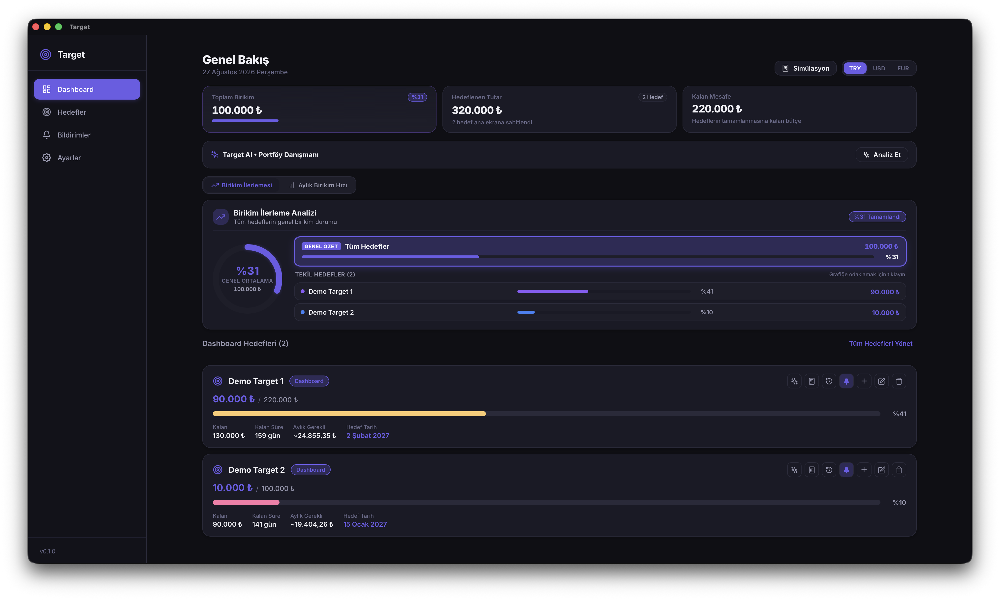
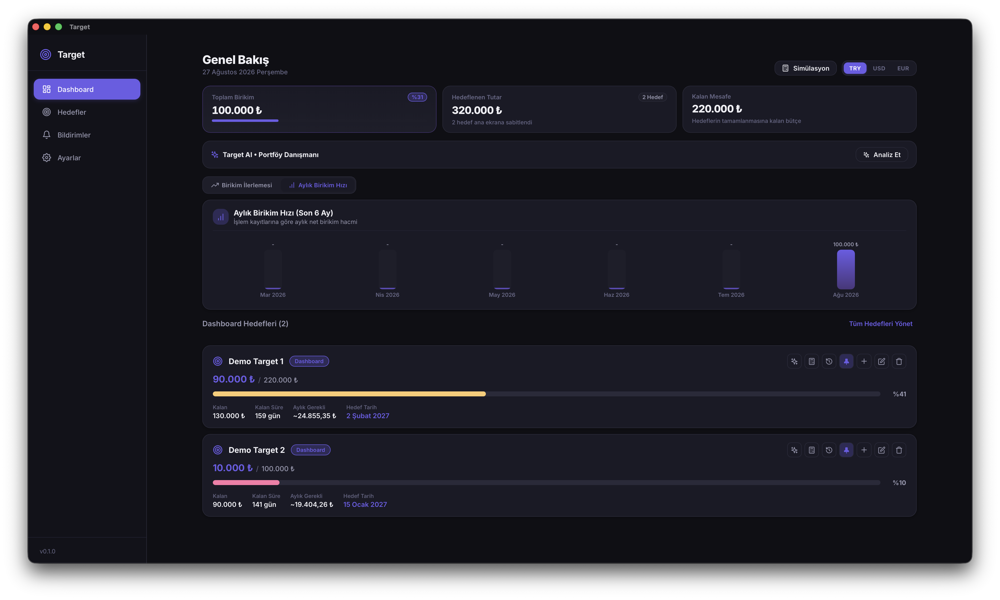
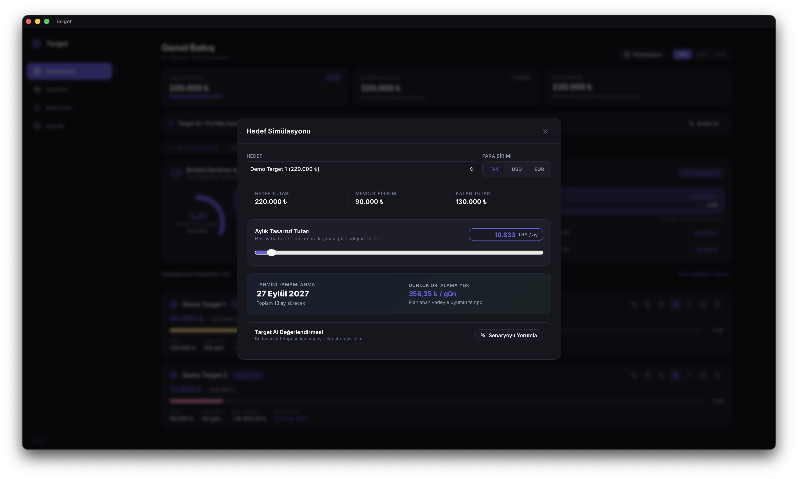
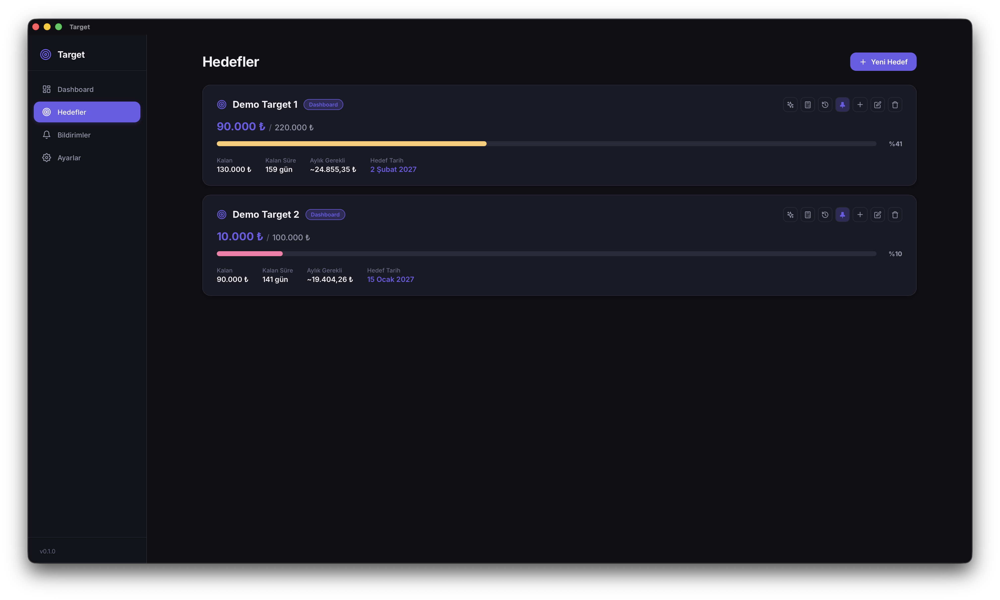
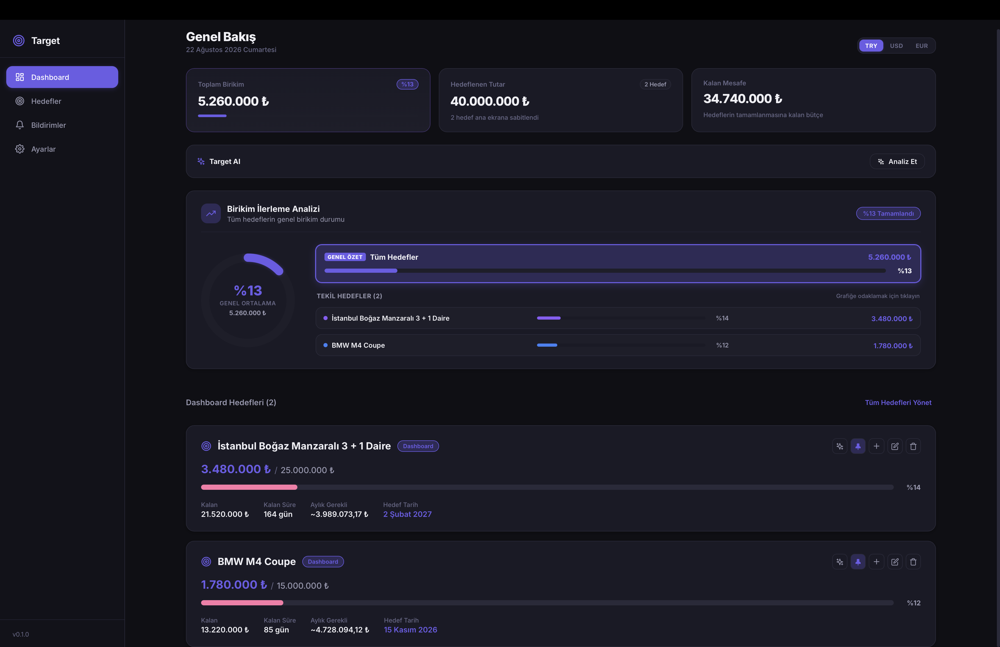
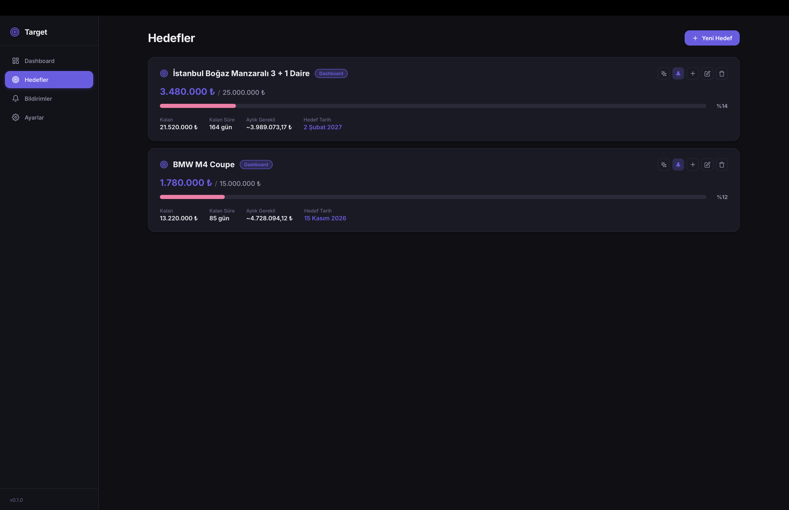

# Target

**[🇬🇧 English Documentation](#-english-documentation) &nbsp;•&nbsp; [🇹🇷 Türkçe Dokümantasyon](#-türkçe-dokümantasyon)**

---

# 🇬🇧 Target • Smart Finance & Goal Tracking Assistant

**Target** is a modern desktop application that plans your savings, tracks your progress, and empowers you to reach your financial milestones faster with AI-powered strategies.

---

## What is Target?

Target allows you to manage all your financial goals—such as buying a home, purchasing a car, funding a vacation, investing in technology, or building an emergency fund—from a single dashboard.

By analyzing your current savings and target deadlines, it generates personalized savings roadmaps, calculates your remaining time, and shows exactly how much you need to save each month to stay on track.

---

## Key Features

- **AI-Powered Financial Strategist (Target AI)**
  - Mathematically analyzes the timeline, capital gap, and required velocity for your goals.
  - Computes the exact **daily and monthly net savings** required to reach deadlines.
  - Delivers actionable execution steps including the 50/30/20 budget framework, expense optimization, and micro-savings strategies.

- **Multi-Currency Support & Live Exchange Rates**
  - Create goals in any currency (**Turkish Lira ₺**, **US Dollar $**, **Euro €**).
  - Seamlessly convert and view your entire portfolio in your preferred dashboard currency with real-time exchange rates.

- **Comprehensive Portfolio & Progress Analytics**
  - Track overall completion rates across all goals with interactive donut and bar charts.
  - Instantly see remaining balances, days left, and individual goal progression at a glance.
  - Pin your highest-priority goals directly to the overview dashboard.

- **Cyclic Wheel Time Picker & Smart Reminders**
  - Set custom notification alarms using an intuitive cyclic drum-wheel time picker.
  - Choose from quick presets (Morning, Noon, Evening, Night) and schedule recurrences (Every Day, Weekdays, Weekends).
  - Stay accountable with regular progress summaries and financial discipline tips.

- **Sleek & Distraction-Free Modern Design**
  - Elegant dark mode, smooth micro-animations, and clean typography tailored for focus.

---

## Application Screens

### 1. Overview (Dashboard - Initial State)
Clean welcome dashboard showing total portfolio balance, target metrics, and quick goal creation:

  

---

### 2. Goals (Initial State)
Goal management center and the entry point for planning your first financial target:

  

---

### 3. Smart Reminders & Alarm Scheduling
Cyclic time wheel picker for configuring reminder times, schedule presets, and notification preferences:

  

---

### 4. Settings & Live Exchange Rates
Theme preferences (Dark / Light), live currency rates (TRY, USD, EUR), and system configurations:

  

---

### 5. Overview & Portfolio Analytics (Active Usage)
Total accumulated savings, overall target capital, remaining balance, donut and bar charts, and pinned priority goals:

  

---

### 6. Goal Management & Detailed Progress
Active goal cards with completion percentages, remaining days, required monthly savings, and one-click Target AI strategic advice:

  

---

## How to Use?

1. **Set a Goal**: Enter what you want to achieve, your target amount, currency, and deadline.
2. **Add Savings**: Update your saved funds over time and watch your progress update live across interactive charts.
3. **Consult Target AI**: Receive personalized financial strategies and actionable budget guidance tailored to your goal timeline.
4. **Set Up Reminders**: Schedule daily or weekly reminders to maintain a consistent saving habit.

---

## License

This project is licensed under the MIT License - see the [LICENSE](LICENSE) file for details.

 

---
---

 

# 🇹🇷 Target • Akıllı Finans ve Hedef Takip Asistanı

**Target**, hayalini kurduğunuz hedeflere ulaşmanız için birikimlerinizi planlayan, ilerlemenizi takip eden ve yapay zeka destekli stratejilerle finansal hedeflerinize daha hızlı ulaşmanızı sağlayan modern bir masaüstü uygulamasıdır.

---

## Target Nedir?

Target; ev, araba, tatil, teknoloji yatırımı veya acil durum fonu gibi belirlediğiniz tüm finansal hedefleri tek bir merkezden yönetmenizi sağlar. 

Mevcut birikimlerinizi ve hedef tarihlerinizi analiz ederek size özel tasarruf planları çıkarır, kalan sürenizi hesaplar ve hedefinize ulaşabilmeniz için her ay ne kadar biriktirmeniz gerektiğini anlık olarak gösterir.

---

## Temel Özellikler

- **Yapay Zeka Destekli Stratejist (Target AI)**
  - Hedeflerinizin vade süresini ve sermaye açığını matematiksel olarak analiz eder.
  - Hedefinize zamanında ulaşabilmeniz için gereken **aylık ve günlük net tasarruf** miktarını hesaplar.
  - Harcama disiplini, bütçe optimizasyonu ve uygulanabilir tasarruf taktikleri ile size özel eylem planları sunar.

- **Çoklu Para Birimi ve Canlı Döviz Kurları**
  - Hedeflerinizi dilediğiniz para biriminde (**Türk Lirası ₺**, **Amerikan Doları $**, **Euro €**) oluşturabilirsiniz.
  - Dashboard üzerinde seçtiğiniz ana para birimine göre tüm portföyünüz anlık canlı kurlar üzerinden otomatik olarak dönüştürülerek hesaplanır.

- **Kapsamlı Portföy ve İlerleme Analitiği**
  - Tüm hedeflerinizin genel tamamlanma oranını dairesel ve çubuk grafiklerle takip edin.
  - Hangi hedefinize ne kadar yaklaştığınızı, kalan gün sayınızı ve kalan bütçenizi tek bakışta görün.
  - Önemli hedeflerinizi ana ekrana sabitleyerek önceliklendirin.

- **Döngüsel Çarklı Saat Seçici ile Akıllı Hatırlatıcılar**
  - Özel tasarlanmış akıcı saat çarkı sayesinde dilediğiniz hatırlatma saatlerini belirleyin.
  - Sabah motivasyonu, öğle kontrolü veya akşam birikim özeti gibi farklı zaman dilimleri için bildirimler ayarlayın.
  - Hafta içi, hafta sonu veya her gün seçenekleriyle tasarruf disiplininizi koruyun.

- **Göz Yormayan Modern Tasarım**
  - Odaklanmayı artıran koyu tema, akıcı geçişler ve sade arayüz.

---

## Uygulama Ekranları

### 1. Genel Bakış (Dashboard - Başlangıç)
Uygulama ilk açıldığında sade ve anlaşılır karşılama ekranı, toplam portföy durumu ve hızlı hedef ekleme:

  

---

### 2. Hedefler (Başlangıç Durumu)
Hedef yönetim alanı ve ilk hedefi oluşturma adımı:

  

---

### 3. Akıllı Hatırlatıcılar ve Bildirimler
Döngüsel saat çarkı ile bildirim saatini ayarlama, hazır zaman şablonları (Sabah, Öğle, Akşam, Gece) ve takip tercihleri:

  

---

### 4. Ayarlar & Canlı Döviz Kurları
Görünüm teması (Koyu / Açık), canlı kur takibi ve genel sistem ayarları:

  

---

### 5. Genel Bakış & Portföy Analizi (Aktif Kullanım)
Toplam birikim durumu, hedeflenen sermaye, kalan bütçe, dairesel & çubuk grafikler ve ana ekrana sabitlenmiş öncelikli hedefler:

  

---

### 6. Hedef Yönetimi & Detaylı İlerleme
Aktif hedeflerin listesi, tamamlanma yüzdeleri, kalan gün süreleri, gereken aylık birikim tutarları ve tek tıkla Target AI strateji butonu:

  

---

## Nasıl Kullanılır?

1. **Hedef Belirleyin**: Almak veya biriktirmek istediğiniz şeyi, hedef tutarını, para birimini ve hedeflediğiniz tarihi girin.
2. **Birikim Ekleyin**: Birikim yaptıkça hedefinize tutar ekleyin ve ilerlemenizi grafikler üzerinden canlı izleyin.
3. **Target AI ile Danışın**: Hedefinizin durumuna göre yapay zekadan kişiselleştirilmiş finansal strateji ve bütçe tavsiyesi alın.
4. **Hatırlatıcıları Kurun**: Bildirim saatlerinizi ayarlayarak tasarruf alışkanlığınızı sürdürülebilir hale getirin.

---

## Lisans

Bu proje MIT Lisansı ile lisanslanmıştır - detaylar için [LICENSE](LICENSE) dosyasına bakabilirsiniz.
